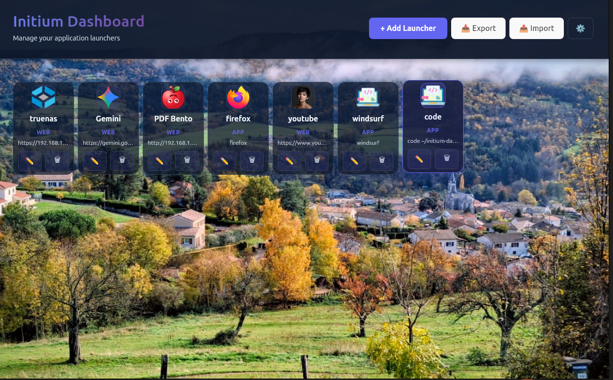

# 🚀 Initium - Dashboard Intelligent

> Tableau de bord intelligent multi-plateforme pour lancer vos applications et sites web préférés.



## ✨ Caractéristiques

- 🖥️ Interface élégante avec fond personnalisable (image ou dégradé)
- 🚀 Lancement d'applications et de sites web en un clic
- 🌍 Multi-plateforme : Linux, Windows, macOS
- 🌐 Localisation : Français, English, Español
- 📁 Gestion d'icônes personnalisées
- 💾 Import/Export de configurations
- ⚙️ Paramètres persistants

## 🛠️ Technologie

- **Backend:** Rust avec Tauri 2.x
- **Frontend:** React + Vite + i18next
- **Packaging:** .deb (Linux), NSIS (Windows), .dmg (macOS)

## 📦 Installation

### Linux (Ubuntu / Debian / Mint)
```bash
sudo dpkg -i Initium_0.9.3_amd64.deb
```

### Windows

Téléchargez et exécutez `Initium_0.9.3_x64-setup.exe`

### macOS

Téléchargez et ouvrez `Initium_0.9.3_x64.dmg`

👉 Tous les binaires sont disponibles sur la page [Releases](https://github.com/Bermotard/initium/releases)

## 🔨 Développement

### Prérequis

- Rust 1.70+ ([Install](https://rustup.rs/))
- Node.js 20+ ([Install](https://nodejs.org/))

### Démarrage rapide
```bash
git clone https://github.com/Bermotard/initium.git
cd initium

# Frontend
cd frontend
npm install
npm run build

# Lancer en mode dev
cd ../src-tauri
cargo tauri dev
```

### Build production
```bash
# Linux
cd frontend && npm run build
cd ../src-tauri && cargo tauri build

# Windows (cross-compilation depuis Linux)
cargo tauri build --target x86_64-pc-windows-gnu
```

### Commandes utiles
```bash
cargo test       # Tests unitaires
cargo clippy     # Lint
cargo fmt        # Formatage
```

## 📚 Documentation

- [CHANGELOG.md](CHANGELOG.md)
- [CONTRIBUTING.md](CONTRIBUTING.md)
- [LICENSE](LICENSE)

## 🤝 Contributions

1. Fork le repository
2. Créez une branche : `git checkout -b feature/ma-feature`
3. Committez : `git commit -am 'feat: description'`
4. Poussez : `git push origin feature/ma-feature`
5. Ouvrez une Pull Request

## 📞 Support

- **Issues:** https://github.com/Bermotard/initium/issues
- **Discussions:** https://github.com/Bermotard/initium/discussions

---

**Initium v0.9.3** | MIT License | [Changelog](CHANGELOG.md)
